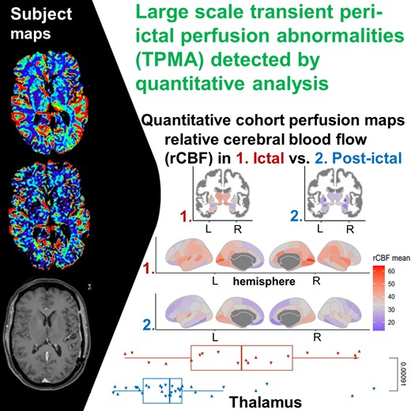

# About qMriMaps



Scripts related to the corresponding [publication](https://doi.org/10.1093/braincomms/fcad047):

```
Köstner, M, Rebsamen, M, Radojewski, P, Rummel, C, Jin, B, Meier, R, Ahmadli, U, Schindler, K and Wiest, R.
Large scale transient peri-ictal perfusion MRI abnormalities detected by quantitative image analysis.
Brain Communications. 2023. https://doi.org/10.1093/braincomms/fcad047
```


# Installation
## Install DL+DiReCT
Follow the install instructions from [https://github.com/SCAN-NRAD/DL-DiReCT](https://github.com/SCAN-NRAD/DL-DiReCT)

## Install qMriMaps
```bash
cd ${HOME}
git clone https://github.com/SCAN-NRAD/qMriMaps.git
cd qMriMaps
pip install -e .
```

## Install R packages
Install R >= 3.6 and make sure you have installed the following packages:

```R
install.packages(c('remotes', 'dplyr', 'ggpubr', 'reshape2', 'grid', 'scales', 'ggrepel', 'stringr'))
remotes::install_github("LCBC-UiO/ggseg", build_vignettes = FALSE)
```

# Usage
## Prepare data
Put data in a directory structure as follows:

```bash
- data
	- subj1
		- anat
			- T1.nii.gz
		- perf
			- rBF.nii.gz
			- rBV.nii.gz
			- tMIP.nii.gz
	- subj2
		- anat
			- T1.nii.gz
		- perf
			- rBF.nii.gz
			- rBV.nii.gz
			- tMIP.nii.gz
	- ...
```

Run qmrimaps with:

```bash
source activate DL_DiReCT
qmrimaps data results
```
